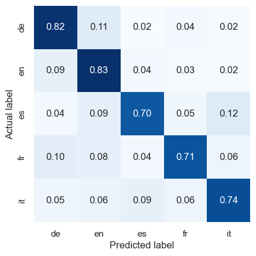
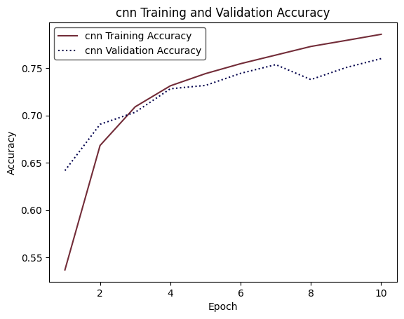
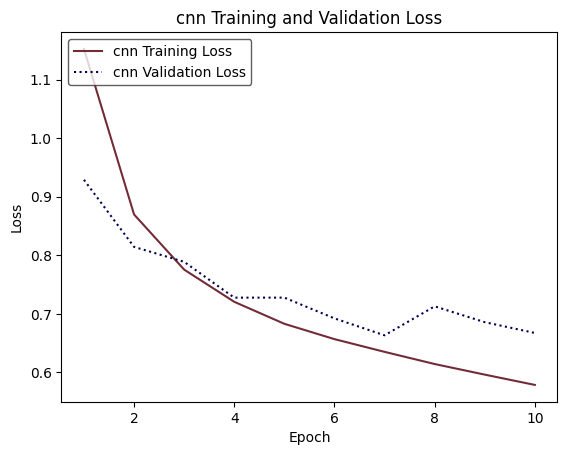

# LangSonic 🎙️

Try out the model on the [LangSonic Website](https://lit-mesa-88597-fe23f01307fc.herokuapp.com/).

## Overview

LangSonic is a reliable Convolutional Neural Network (CNN) model designed for rapid spoken-language classification. It processes audio files into log-mel spectrograms to accurately identify the language within.

## Supported Languages

LangSonic supports the following languages:

- English 🇺🇸
- German 🇩🇪
- French 🇫🇷
- Spanish 🇪🇸
- Italian 🇮🇹

## Key Features

- **Efficient Processing:** LangSonic employs a high-speed CNN architecture for swift and efficient analysis of audio spectrograms.
- **Precision:** The model is finely tuned to ensure accurate language classification, prioritizing reliability in diverse applications.
- **Training Time:** The chosen CNN architecture is simple and quick to train. If you want to modify it or add a language, just add and process the data. On an M1 Pro chip, it takes approximately 20 minutes to train.

## Metrics

### Final Model Performance

LangSonic achieves an accuracy of 76% when classifying between English, German, French, Spanish, and Italian—comparable to a similar CNN model evaluated by Sergey Vilov. The confusion matrix highlights common misclassifications, while accuracy metrics for each language provide insights into the model's performance.

Training on a dataset of 450,000 spectrograms (5 languages at ~90,000 clips per language) for 10 epochs took approximately 20 minutes on an Apple M1 Pro chip.








## Running the Model Locally

To run the model locally, follow these steps:

1. Clone the repository:

    ```bash
    git clone https://github.com/thabnir/LangSonic
    ```

2. Navigate to the `flask/` directory inside the repo:

    ```bash
    cd LangSonic/flask
    ```

3. Install the required packages:

    ```bash
    pip install -r requirements.txt
    ```

4. Run the app:

    ```bash
    python app.py
    ```

This will serve the site on [localhost:5678/](http://localhost:5678/) for you to try out locally.

## Repository Organization

This repository contains both the scripts used to train the model and the code required to build the web app. The dataset used to train the model is a subset of Mozilla Common Voice, comprising the first three .zip files in the dataset for each language, each containing 40,000 audio samples. It can be obtained from [Mozilla Common Voice Dataset](https://huggingface.co/datasets/mozilla-foundation/common_voice_13_0).

Data should be stored in `/data/<langname>/<filename>.mp3` (e.g., `data/mp3/en/common_voice_en_73382.mp3`). Then, run [`data_processing.ipynb`](data_processing.ipynb). This will process the audio files into spectrograms in `/data/spectrogram/<langname>_train_new/<filename>.png`. Finally, run [`training.ipynb`](training.ipynb).

Reports for the associated MAIS 202 project can be found in `reports/`, and code for the website is located in `flask/`. Data processing code for the model's training is in [`data_processing.ipynb`](data_processing.ipynb), and model training code is in [`training.ipynb`](training.ipynb).
The paper can be found at [paper.pdf](paper.pdf).

## License

This project is licensed under the MIT License - see [LICENSE.txt](LICENSE.txt) for details.
